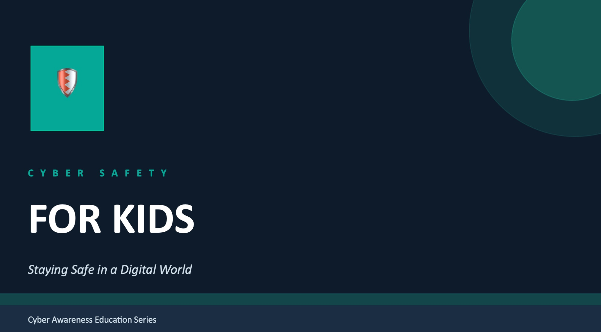
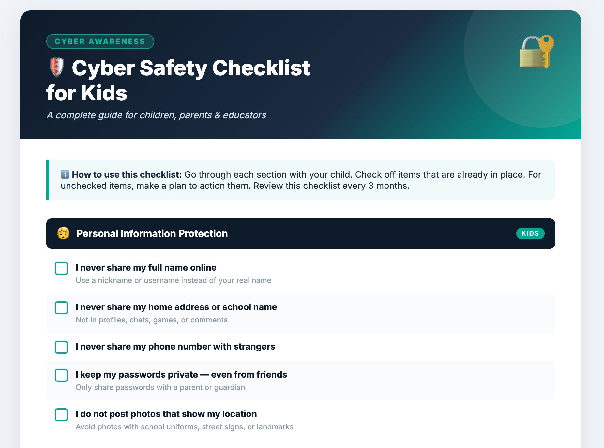
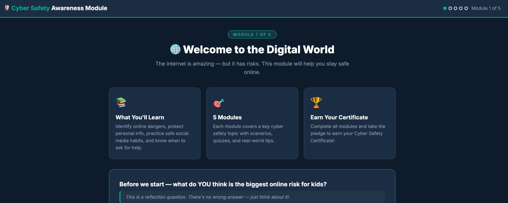

# Cyber Awareness for All 🌐🔐

> **An open-source cybersecurity awareness initiative** — educating children, parents, and organizations on digital safety, privacy, and threat prevention.

[](LICENSE)
[](https://github.com/samanwayam/cyber-awareness-for-all)
[](CONTRIBUTING.md)
[](#)

---

## 🎯 Mission

To simplify cybersecurity and make awareness **accessible to everyone** — from young children to working professionals — through interactive, practical, and jargon-free resources.

> 💡 *Human error is the #1 cause of security breaches. Awareness is the first line of defense.*

---

## 📦 What's Inside

| Resource | Type | Audience | Description |
|----------|------|----------|-------------|
| 📊 [Cyber Safety Presentation](presentations/cyber-safety-awareness-session/) | `.pptx` | Parents · Educators | 10-slide deck covering threats, rules, and response strategies |
| ✅ [Interactive Checklist](presentations/checklists/CyberSafety_Kids_Checklist.html) | `.html` | Kids · Parents | 32-item checklist with live progress tracking |
| 🎓 [Awareness Module](presentations/awareness-modules/kids-online-safety/CyberSafety_Kids_AwarenessModule.html) | `.html` | Kids · Educators | 5-module interactive course with quizzes & completion certificate |


---

## 🖼️ Screenshots

<table>
  <tr>
    <td align="center"><br><sub><b>📊 Presentation</b> — ready for classroom or workshop use</sub></td>
    <td align="center"><br><sub><b>✅ Interactive Checklist</b> — track safety habits in real time</sub></td>
    <td align="center"><br><sub><b>🎓 Awareness Module</b> — quizzes, scenarios & certificate</sub></td>
  </tr>
</table>

> 📁 To display screenshots: create a `screenshots/` folder in your repo root and add `presentation.png`, `checklist.png`, and `module.png` to it.

---

## ▶️ How to Use

### For Kids & Parents (No setup needed)
1. Download the HTML files from the [`presentations/`](presentations/) folder
2. Open in any modern browser (Chrome, Firefox, Safari, Edge)
3. Work through the modules together — no internet required after download

### For Educators & Organizations
1. Clone or download the repository
   ```bash
   git clone https://github.com/samanwayam/cyber-awareness-for-all.git
   ```
2. Open HTML files directly in a browser for self-paced learning
3. Use the `.pptx` presentation for live awareness sessions or workshops
4. Print the checklist as a take-home activity for students or families

---

## 🌟 What Makes This Different

| Feature | This Project | Typical Awareness Content |
|---------|-------------|--------------------------|
| Interactive quizzes | ✅ | ❌ |
| Scenario-based learning | ✅ | ❌ |
| Live progress tracking | ✅ | ❌ |
| Completion certificate | ✅ | ❌ |
| No login / no data collected | ✅ | ❌ |
| Works offline | ✅ | ❌ |
| Designed for children | ✅ | Rarely |

---

## 👨‍👩‍👧 Who This Is For

- 🧒 **Children (ages 8–16)** — Learn to stay safe online through stories and scenarios
- 👪 **Parents & Guardians** — Understand risks and have better digital conversations with kids
- 🏫 **Teachers & Schools** — Ready-to-use classroom resources, no tech setup needed
- 🏢 **Organizations & HR Teams** — Run quick, engaging awareness sessions
- 🔐 **IT & Security Professionals** — Share with non-technical colleagues and communities

---

## 📚 Topics Covered

- 🔒 Personal Information Protection
- 🎣 Phishing & Social Engineering
- 😈 Grooming & Online Predators
- 💬 Cyberbullying — Recognition & Response
- 🦠 Malware & Suspicious Downloads
- 🔐 Password Safety & Two-Factor Authentication
- 📱 Safe Social Media Practices
- 🏠 Home Device & Network Security
- 🗣️ What To Do When Something Goes Wrong

---

## 📊 Impact Vision

- Improve cybersecurity awareness among families and communities
- Reduce phishing and social engineering risks through practical education
- Enable schools and organizations to run awareness sessions with zero technical overhead
- Build a resource library that grows with evolving digital threats

---

## 🤝 Contributing

Contributions are warmly welcome from security professionals, educators, translators, and designers.

**Ways to contribute:**
- Add a new awareness module or topic
- Translate content into regional languages (Malayalam, Hindi, Tamil, etc.)
- Improve existing content for accuracy or clarity
- Report issues or suggest improvements via [GitHub Issues](https://github.com/samanwayam/cyber-awareness-for-all/issues)

Please open an issue before submitting a large pull request so we can discuss the direction together.

---

## 🗺️ Roadmap

- [ ] Regional language support (Malayalam, Hindi, Tamil)
- [ ] Parent & educator guide PDF
- [ ] Modules for adults and workplace safety
- [ ] AI-assisted awareness simulations
- [ ] Accessibility improvements (screen reader support, high contrast)

---

## 📜 License

This project is licensed under the [MIT License](LICENSE). Free to use, share, and adapt — attribution appreciated.

---

## ⭐ Support

If you find this useful, please **star the repo** and share it with a parent, teacher, or community around you. Every share helps someone stay safer online.

---

<p align="center">
  Made with ❤️ to keep kids safer online · <a href="https://github.com/samanwayam/cyber-awareness-for-all">cyber-awareness-for-all</a>
</p>
